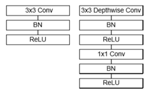
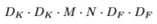
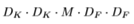
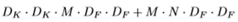
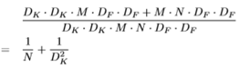
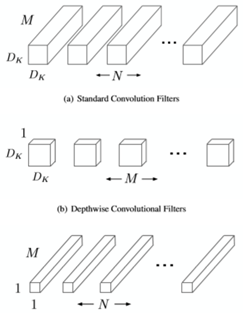
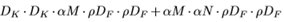
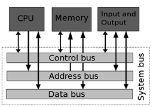

**MobileNets: An efficient and faster Convolutional Neural Networks for
Mobile Vision Applications**

Ashwani Kumar Kashyap

AXK190033\@utdallas.edu

Dec 31, 2012

**Abstract**

*We present a class of efficient models called MobileNet \[1\] for
mobile applications and for the devices with limited computational
resources. We Introduce a new architecture called depthwise separable
convolution to build a light weight deep neural network with a
reasonable trade-off between efficiency and latency. We presented
extensive experiments with respect to the two hyperparameters of the new
design which show strong performance in terms of speed and accuracy
compared to previous networks. We analyzed the performance of the model
by computing the data movement and computation time for each layer in
the architecture.*

**1 Introduction**

Convolution Neural Networks represent a huge breakthrough in the field
of Computer Vision. CNNs can be used in tons of applications from image
and video recognition, image classification, and recommender systems to
natural language processing and medical image analysis. Evidence Reveals
that the network depth is of crucial importance in increasing the
accuracy of the model. Leading results on the challenging ImageNet
dataset utilizes deep models with a depth of sixteen to thirty.

All these techniques may contribute to the increase in the overall
accuracy of the model but are not necessarily making it's efficient in
terms of speed, size and overall complexity. Bigger sized models require
more computational resources. In real life, many computer visions
applications are used in cell phones, robotics, self-driving car and
augmented reality in which the recognition tasks need to be done in a
very limited time with a limited computational resource. In order to
increase speed, you might have to sacrifice accuracy.

In this paper, we describe an efficient neural network architecture that
deals with such a trade-off. Sections 2 reviews prior work done in the
field related to image classification. Section 3 describes the new
network design (mobileNet) focusing on the encoder (body) - building
block structure, and decoder (head) - efficient for classification.
Section 4 describes new training methods and detailed description of
'training data loss' and 'validation data accuracy' curves with
different experiments tried and their results. Section 5 describes the
model's performance prediction strategy. Description of external memory,
DDR bus, internal memory, matrix compute and per layer memory location
assignment and predicted data movement with compute time on the host
machine.

**2 Related Work**

**2.1 Design**

LeNet, 7-level convolution network was one of the first convolutional
neural networks that thrusted the field of deep of learning. Since the
image features are distributed across the entire image, convolutions
with learnable parameters are an effective way to extract related
features at multiple location with few parameters. Therefore, being able
to save parameter and computation was a key advantage in LenNet.
However, the ability to process higher resolution images required larger
and more convolution layers, so this technique is constrained by the
availability of computing resources.

In 2012, Alex Krizhevsky released AlexNet which was a deeper and much
wider version of LeNet and utilized rectified linear unites (ReLU) as
non-linearities, dropout technique to selectively ignore neurons during
training to avoid overfitting, overlapping max pooling, Stochastic
Gradient Descent \[6\] with momentum, GPU's NVIDIA GTX 580 to reduce
training time. AlexNet suffers from the issues of many free parameters
in larger filters, data locality for local response norm and issues of
memory in fully connected layers. Real time implementation is implicitly
a memory bandwidth test.

**2.2 Training**

In Batch Gradient Descent we take the average of the gradients of all
training examples and then use that mean gradient to update the
parameters of the models. In Stochastic Gradient However in Stochastic
Gradient Descent (SGD), we consider just one example at a time to take a
single step. Batch Gradient Descent can be used for smoother curves. SGD
can be used when the dataset is large.

Mini Batch SGD is the combination of both the two techniques. We use
batch of a fixed number of training examples which is less than the
actual dataset and call it a mini batch. We than calculate the mean
gradient of the mini batch and update the weights. Doing this helps up
to achieve the advantages of both of former variants.

However, just like SGD, the average cost over the epochs in mini-batch
gradient descent fluctuates because we are averaging a small number of
examples at a time which many times result in a low final accuracy.
Hyperparameter optimization is a real pain in this technique. Compared
to dataset, if your mini-batch size is too small, it won\'t converge.
and also, large minibatches cause optimization difficulties, but when
these are addressed the trained networks exhibit good generalization.

**2.3 Implementation**

X86 CPUs are central processing units for a computational machine. They
are usually multi-core from 2-10 cores in modern i3-i9 intel CPU's and
may go up to 18 cores in high-end intel CPUs. However, CPUs are not the
considered as the choice for training of deep learning models. In the
experiments, attempts have been made to use clusters of CPUs for deep
learning. Optimizing DL libraries for CPUs, but the performance results
were not promising when compared to GPU's and CPU's only seem useful if
you already have a cluster of machines without GPU's. For workloads
heavy in AVX-512 the CPU reduces the clock frequency.

The most modern DL systems are a mix of CPU and GPU, where the GPU does
the heavy lifting, and CPU is responsible for loading the data into/from
the memory of a graphics card and orchestrating the calculations. Modern
GPUs contain a lot of processors and are highly parallel, which makes
them very effective for deep learning models training. GPU's have much
more specialized cored (up to 5120 in the latest NVIDIA Volta V1000
GPU's) and matrix operations are parallelized much better in GPU's.
Unified Memory creates a pool of managed memory that is shared between
the CPU and GPU, bridging the CPU-GPU divide to be used efficiently when
combined.

**3 Design**

**3.1 Depthwise Separable Convolution**

We introduce a new type of block design in MobileNet called depthwise
separable convolution which in turn is a combination of two convolution
operations -- depthwise convolution and a 1x1 pointwise convolution. In
depth convolution, for mobileNets we apply one single filter to each of
the input channel and then combine the output of it with one pointwise
1x1 convolution. A standard convolution filters and mixes across
channels from input into a new set of output in single step. In
depthwise separable convolution this task is split into two layers - one
for filtering and one for combining.

{width="2.633561898512686in"
height="1.6668110236220472in"}

**Figure 1: Left: Standard convolution layer with batchnorm and ReLU.
Right: Depthwise Separable convolution with Depthwise and pointwise
layers by batchnorm and ReLU.**

A standard convolutional layer takes input as D~f~ x D~f~ x M feature
map F and produces a D~g~ x D~g~ x N feature map G where D~f~ is the
special width and height of a square input feature map. M is the number
of input channels D~g~ is the special width and height of a square
output feature map and N is the number of output channel. The standard
convolution layer is parameterized by convolution kernel K of size of
D~k~ x D~k~ x M x N where D~k~ is the spatial dimension of the kernel
assumed to be square. For the given parameters, standard convolution has
the computational cost of:

{width="1.633474409448819in"
height="0.2500218722659667in"} (1)

MobileNet breaks uses depthwise separable convolution to break the
interaction of these terms between the number of output channels and the
size of the kernel. We first use depthwise convolution to apply a single
filter per each input channel. Then we use pointwise 1x1 convolution to
create linear combination of the output of the depthwise layer.
MobileNets use both batchnorm and ReLU nonlinearities for both layers.
For the mentioned parameters, depthwise convolution has a computational
cost of:

{width="1.4001213910761154in"
height="0.2500218722659667in"} (2)

Depthwise convolution are efficient with respect to standard
convolution, however it only filters input channels, it does not combine
them to create new features. An additional layer is required to combine
the output of the depthwise convolution via 1x1 convolution to generate
new features. Overall depthwise separable convolution cost can be
written as:

{width="2.475214348206474in"
height="0.2250196850393701in"} (3)

The sum of the depthwise and 1x1 pointwise convolutions. If we express
convolution as a two-step process of filtering and combining, we get a
reduction in computation of:

{width="2.725236220472441in"
height="0.7667333770778653in"} (4)

MobileNet utilizes 3x3 depthwise separable convolutions which leads to 8
to 9 times less computations than standard convolution at only a small
reduction in accuracy.

{width="2.5316666666666667in"
height="3.26336176727909in"}

**Figure 2. The standard convolution filters in (a) are replaced by two
layers: depthwise convolution in (b) and pointwise convolution in (c) to
build to a depthwise separable filter**

**3.2 Network Structure**

The MobileNet structure is built on depthwise separable convolution with
an exception of first layer which is a full convolution. The mobileNet
architecture (body and head) is defined in the Table 1. In the body of
the model, all layers are followed by a batchnorm and ReLU nonlinearity.
Counting depthwise and pointwise convolutions as separate layers,
MobileNet has 28 layers. Down sampling is being taken care of by
striding in the depthwise convolution.

At the end (head), the final average pooling reduces the special
resolution to 1 before the fully connected layer. Fully connected layer
has no nonlinearity and feeds into a SoftMax layer for classification.
Cross Entropy is used to compute the loss each epoch.

**Table 1. MobileNet Body and Head Architecture**

+-----------------------+-------------------+---------------+
| Type/Stride           | Filter Shape      | Input size    |
+=======================+===================+===============+
| Body                  |                   |               |
+-----------------------+-------------------+---------------+
| Conv / s1             | 3 x 3 x 3 x 32    | 28 x 28 x 3   |
+-----------------------+-------------------+---------------+
| Conv dw /s1           | 3 x 3 x 32 dw     | 28 x 28 x 32  |
+-----------------------+-------------------+---------------+
| Conv / s1             | 1 x 1 x 32 x 64   | 28 x 28 x 32  |
+-----------------------+-------------------+---------------+
| Conv dw / s2          | 3 x 3 x 64 dw     | 28 x 28 x 64  |
+-----------------------+-------------------+---------------+
| Conv / s1             | 1 x 1 x 64 x 64   | 14 x 14 x 64  |
+-----------------------+-------------------+---------------+
| Conv dw / s1          | 3 x 3 x 64 dw     | 14 x 14 x 64  |
+-----------------------+-------------------+---------------+
| Conv /s1              | 1 x 1 x 64 x 128  | 14 x 14 x 64  |
+-----------------------+-------------------+---------------+
| Conv dw /s1           | 3 x 3 x 128 dw    | 14 x 14 x 128 |
+-----------------------+-------------------+---------------+
| Conv / s1             | 1 x 1 x 128 x 128 | 14 x 14 x 128 |
+-----------------------+-------------------+---------------+
| Conv dw / s1          | 3 x 3 x 128 dw    | 14 x 14 x 128 |
+-----------------------+-------------------+---------------+
| Conv / s1             | 1 x 1 x 128 x 128 | 14 x 14 x 128 |
+-----------------------+-------------------+---------------+
| Conv dw / s1          | 3 x 3 x 128 dw    | 14 x 14 x 128 |
+-----------------------+-------------------+---------------+
| Conv / s1             | 1 x 1 x 128 x 256 | 14 x 14 x 128 |
+-----------------------+-------------------+---------------+
| 5x                    | 3 x 3 x 256 dw    | 14 x 14 x 256 |
|                       |                   |               |
| (Conv dw/s1, conv/s1) | 1 x 1 x 256 x 256 | 14 x 14 x 256 |
+-----------------------+-------------------+---------------+
| Conv dw / s2          | 3 x 3 x 256 dw    | 14 x 14 x 256 |
+-----------------------+-------------------+---------------+
| Conv / s1             | 1 x 1 x 256 x 256 | 7 x 7 x 256   |
+-----------------------+-------------------+---------------+
| Conv dw / s1          | 3 x 3 x 256 dw    | 7 x 7 x 256   |
+-----------------------+-------------------+---------------+
| Conv / s1             | 1 x 1 x 256 x 256 | 7 x 7 x 256   |
+-----------------------+-------------------+---------------+
| Head                  |                   |               |
+-----------------------+-------------------+---------------+
| Avg Pool / s1         | Pool 7 x 7        | 7 x 7 x 256   |
+-----------------------+-------------------+---------------+
| FC / s1               | 256 x 1000        | 1 x 1 256     |
+-----------------------+-------------------+---------------+
| Softmax / s1          | Classifier        | 1 x 1 x 10    |
+-----------------------+-------------------+---------------+

**4 Training**

The model is trained on CIFAR10 \[2\] dataset in TenserFlow using
RMSprop \[3\] for the weight update. Contrary to large models we used
less regularization and data augmentation techniques because small
models has lesser tendency for the overfitting. Data is normalized by
subtracting its mean and then dividing it by its variance. Random
left-right flip and image cropping is done to reduce the resolution of
images from 32x32 to 28x28.

After the preprocessing the data is passed through the body of the model
where all layers are followed by a batchnorm and ReLU nonlinearity as
shown in figure 1. Batch normalization \[7\] is used to increase the
stability of a neural network as it normalizes the output of a previous
activation layer by subtracting the batch mean and dividing by the batch
standard deviation and also it allows each layer of a network to learn
by itself a little bit more independently of other layers. Cross Entropy
is used to compute the loss each epoch.

The base MobileNet architecture is already small with low latency, we
can make it even smaller and faster. In the model we introduce two hyper
parameters called Width Multiplier and Resolution Multiplier. The role
of the width multiplier α Є (0, 1\] is to thin a network uniformly at
each layer. Resolution multiplier ρ Є (0, 1\] when applied to the input
image the internal representation of every layer is subsequently
reduced.

The computational cost for the layers with the multipliers can be
written as:

{width="2.9583333333333335in" height="0.225in"}

\(5\)

With lower values of width multipliers and resolution multipliers we
might get lower accuracy, but it significantly increases the network
speed and reduces requirement of computational resources. Since we are
training on CIFAR10, we kept the value of resolution multiplier as 1
(Image resolutions are already very small). Table 2 shows two
experiments for different value of width multiplier with their
validation accuracy on CIFAR10 dataset.

**Table 2: Validation accuracy and loss for different values of width
multipliers**

  Width Multiplier   Test Accuracy   Test Loss
  ------------------ --------------- -----------
  1                  0.82            0.91
  0.75               0.78            0.95

Figure 3 and 4 below represents training and validation data accuracy
and loss during training for 60 epochs. The X axis represents epochs and
Y axis represent accuracy and loss respectively.

{width="3.125in" height="1.4099420384951882in"}

**Figure 3: Training and validation accuracy curve on CIFAR10 dataset**

{width="3.125in" height="1.5416666666666667in"}

**Figure 4: Training and validation loss curve on CIFAR10 dataset**

**5 Implementation**

The architecture of the model contains altogether 27 layers excluding
batch normalization and pointwise nonlinearity. Since input/output
feature map generated at each layer from CIFAR10 dataset is small, we
can store it in internal memory of size 1 MB. At each layer, filter
coefficients are required to be moved from internal to external and then
vice versa to perform convolution operation.

Table 3 describes the total size of internal memory at each layer (input
feature + output feature map + filter coefficient size) and data
movement (If required). After the 26^th^ layer the internal memory
storage exceeds the memory limit of size 1MB, so the data is moved to
the external memory which contributed to the increase in data movement
size.

**Table 3: I/O feature map size and location with internal memory used
and data movement size each layer.**

+----------------+----------------+----------------+----------------+
| La-            | I/O feature    | Internal       | Data Mov. size |
|                | map size       | Memory used    | (bits)         |
| yers           | (Stored in     | (bits)         |                |
|                | Internal       |                |                |
|                | Memory)        |                |                |
+================+================+================+================+
| 1              | 18816, 200704  | 220384         | 20544          |
+----------------+----------------+----------------+----------------+
| 2              | 200704, 200704 | 421376         | 576            |
+----------------+----------------+----------------+----------------+
| 3              | 200704, 401408 | 824832         | 4096           |
+----------------+----------------+----------------+----------------+
| 4              | 401408, 401408 | 1226816        | 1152           |
+----------------+----------------+----------------+----------------+
| 5              | 401408, 200704 | 1435712        | 16384          |
+----------------+----------------+----------------+----------------+
| 6              | 200704, 100352 | 1536640        | 1152           |
+----------------+----------------+----------------+----------------+
| 7              | 100352, 200704 | 1745536        | 16384          |
+----------------+----------------+----------------+----------------+
| 8              | 200704, 200704 | 1947392        | 2304           |
+----------------+----------------+----------------+----------------+
| 9              | 200704, 200704 | 2156288        | 16384          |
+----------------+----------------+----------------+----------------+
| 10             | 200704, 200704 | 2358144        | 2304           |
+----------------+----------------+----------------+----------------+
| 11             | 200704, 200704 | 2575232        | 32768          |
+----------------+----------------+----------------+----------------+
| 12             | 200704, 200704 | 2777088        | 2304           |
+----------------+----------------+----------------+----------------+
| 13             | 200704, 404544 | 3214400        | 65536          |
+----------------+----------------+----------------+----------------+
| 14             | 404544, 401408 | 3618112        | 4608           |
+----------------+----------------+----------------+----------------+
| 15             | 401408, 401408 | 4085056        | 131072         |
+----------------+----------------+----------------+----------------+
| 16             | 401408, 401408 | 4488768        | 4608           |
+----------------+----------------+----------------+----------------+
| 17             | 401408, 401408 | 4955712        | 131072         |
+----------------+----------------+----------------+----------------+
| 18             | 401408, 401408 | 5359424        | 4608           |
+----------------+----------------+----------------+----------------+
| 19             | 401408, 401408 | 5826368        | 131072         |
+----------------+----------------+----------------+----------------+
| 20             | 401408, 401408 | 6230080        | 4608           |
+----------------+----------------+----------------+----------------+
| 21             | 401408, 401408 | 6697024        | 131072         |
+----------------+----------------+----------------+----------------+
| 22             | 401408, 401408 | 7100736        | 4608           |
+----------------+----------------+----------------+----------------+
| 23             | 401408, 401408 | 7567680        | 131072         |
+----------------+----------------+----------------+----------------+
| 24             | 401408, 401408 | 7971392        | 4608           |
+----------------+----------------+----------------+----------------+
| 25             | 401408, 100352 | 8137280        | 8202816        |
+----------------+----------------+----------------+----------------+
| Memory limit   |                |                |                |
| exceeded, so   |                |                |                |
| data is moved. |                |                |                |
+----------------+----------------+----------------+----------------+
| 26             | 100352,100352  | 203008         | 4608           |
+----------------+----------------+----------------+----------------+
| 27             | 100352,100352  | 368896         | 131072         |
+----------------+----------------+----------------+----------------+

{width="2.6694444444444443in"
height="1.8618963254593175in"}

**Figure 5: DDR 3 bus architecture.**

1 GB/s DDR bus is being used to move data from internal to external and
the time taken for the process is described in table 4. In order to
compute the performance time of a single input for each layer we sum its
data movement time and compute time. Compute time is calculated as the
sum of the CNN style 2D convolution and matrix multiplication as 2x the
number of MACS in the operator / 1 TFLOOPS and sum of all the operators
as the number of ops in the operator / 10 GFLOPS. Table 4 shows the
performance time (data movement time + compute time) of each layer for a
single input and sum-total of all the layers to get a predicted
performance time of the model.

**Table 4: I/O feature map size and location with internal memory used
and data movement size each layer.**

+----------------+----------------+----------------+----------------+
| La-            | Data Movement  | Compute Time   | Performance    |
|                | Time (sec, A)  | (sec, B)       | Time (sec,     |
| yers           |                |                | A+B)           |
+================+================+================+================+
| 1              | 0.000002568    | 1.35475E-06    | 3.92275E-06    |
+----------------+----------------+----------------+----------------+
| 2              | 0.000000072    | 4.51584E-07    | 5.23584E-07    |
+----------------+----------------+----------------+----------------+
| 3              | 0.000000512    | 3.21126E-06    | 3.72326E-06    |
+----------------+----------------+----------------+----------------+
| 4              | 0.000000144    | 9.03168E-07    | 1.04717E-06    |
+----------------+----------------+----------------+----------------+
| 5              | 0.000002048    | 1.60563E-06    | 3.65363E-06    |
+----------------+----------------+----------------+----------------+
| 6              | 0.000000144    | 2.25792E-07    | 3.69792E-07    |
+----------------+----------------+----------------+----------------+
| 7              | 0.000002048    | 3.21126E-06    | 5.25926E-06    |
+----------------+----------------+----------------+----------------+
| 8              | 0.000000288    | 4.51584E-07    | 7.39584E-07    |
+----------------+----------------+----------------+----------------+
| 9              | 0.000002048    | 6.42253E-06    | 8.47053E-06    |
+----------------+----------------+----------------+----------------+
| 10             | 0.000000288    | 4.51584E-07    | 7.39584E-07    |
+----------------+----------------+----------------+----------------+
| 11             | 0.000004096    | 6.42253E-06    | 1.05185E-05    |
+----------------+----------------+----------------+----------------+
| 12             | 0.000000288    | 4.51584E-07    | 7.39584E-07    |
+----------------+----------------+----------------+----------------+
| 13             | 0.000008192    | 1.28451E-05    | 2.10371E-05    |
+----------------+----------------+----------------+----------------+
| 14             | 0.000000576    | 9.03168E-07    | 1.47917E-06    |
+----------------+----------------+----------------+----------------+
| 15             | 0.000016384    | 2.56901E-05    | 4.20741E-05    |
+----------------+----------------+----------------+----------------+
| 16             | 0.000000576    | 9.03168E-07    | 1.47917E-06    |
+----------------+----------------+----------------+----------------+
| 17             | 0.000016384    | 2.56901E-05    | 4.20741E-05    |
+----------------+----------------+----------------+----------------+
| 18             | 0.000000576    | 9.03168E-07    | 1.47917E-06    |
+----------------+----------------+----------------+----------------+
| 19             | 0.000016384    | 2.56901E-05    | 4.20741E-05    |
+----------------+----------------+----------------+----------------+
| 20             | 0.000000576    | 9.03168E-07    | 1.47917E-06    |
+----------------+----------------+----------------+----------------+
| 21             | 0.000016384    | 2.56901E-05    | 4.20741E-05    |
+----------------+----------------+----------------+----------------+
| 22             | 0.000000576    | 9.03168E-07    | 1.47917E-06    |
+----------------+----------------+----------------+----------------+
| 23             | 0.000016384    | 2.56901E-05    | 4.20741E-05    |
+----------------+----------------+----------------+----------------+
| 24             | 0.000000576    | 9.03168E-07    | 1.47917E-06    |
+----------------+----------------+----------------+----------------+
| 25             | 0.001025352    | 6.42253E-06    | 0.001031775    |
+----------------+----------------+----------------+----------------+
| Memory limit   |                |                |                |
| exceeded, so   |                |                |                |
| data is moved. |                |                |                |
+----------------+----------------+----------------+----------------+
| 26             | 0.000000576    | 2.25792E-07    | 8.01792E-07    |
+----------------+----------------+----------------+----------------+
| 27             | 0.000016384    | 6.42253E-06    | 2.28065E-05    |
+----------------+----------------+----------------+----------------+
| Total          |                |                |                |
| Performance    |                |                |                |
| Time =         |                |                |                |
| 0.001340632    |                |                |                |
+----------------+----------------+----------------+----------------+

From Table 4 we can see that the performance time of layer 26 is
considerably more than any other layers of the model because of the
large data movement time due the internal memory limit of 1mb as well as
because of the large filter coefficient size compared to the other
layers.

**6 Conclusion**

We introduced a new model architecture called mobileNets based on
depthwise separable convolution. We discussed about some of prior
techniques that exists in the convolution based neural networks and
limitations of it. We then discussed a design technique focusing on
smaller and faster network with a reasonable trade off with accuracy and
introduced a training method that considerably decreased the
computational cost of the whole model with reasonable accuracy. We
presented some of the results of the developed model and with respect to
its hyperparameters. We then analyzed the performance of our model on a
machine with a given set of resources and compared the performance of
each layer as well as the of a whole model to process a single output.

Please find the implementation of the model in the following link

<https://colab.research.google.com/drive/1cGmZG447Qdmm-9c9JBUMVDIrnNiD9Z1n>

**References**

Note: As stated above, this paper is a work of fiction. The following
are the actual inventors of the ideas described in this paper.

\[1\] A. Howard, et. al., "MobileNets: Efficient Convolutional Neural
Networks for Mobile Vision Applications," arXiv:1704.04861, 2017.

\[2\] A. Krizhevsky, "Convolutional Deep Belief Networks on CIFAR-10,"
Unpublished manuscript, 2010.

\[3\] Y. LeCun, et. al., "Gradient-based Learning Applied to Document
Recognition," Proceedingsof the IEEE, vol. 86, no. 11, pp. 2278--2324,
1998.

\[4\] A. Krizhevsky, et. al., "ImageNet Classification with Deep
ConvolutionalNeural Networks," In Advances in neural information
processing systems, pages 1097--1105, 2012.

\[5\] O. Russakovsky, et. al., "ImageNet Large Scale Visual Recognition
Challenge" International Journal of Computer Vision, 115(3):211--252,
2012.

\[6\] L. Bottou, "Large-scale Machine Learning with Stochastic Gradient
Descent," inProc. 19th Int. Conf. Comput. Statist., 2010.

\[7\] S. Ioffe and C. Szegedy, "Batch Normalization: Accelerating Deep
Network Training by Reducing Internal Covariate Shift,"
arXiv:1502.03167, 2015.

\[8\] V. Nair and G. Hinton, "Rectified Linear Units Improve Restricted
Boltzmann Machines", ICML, 2010.
